# 基于Springboot的大学生租房平台

## Springboot-0007


## 技术栈

Springboot mybatisplus vue mysql maven


## 数据库表(9张)


## 功能介绍

```properties
管理员：
本系统的管理员拥有较高的管理权限，管理员角色功能设计主要包括密码信息管理、注册用户管理、区域管理、出租管理等模块。密码信息管理，可以管理本账号相关的密码信息；注册用户管理，可以管理相关的注册用户信息；区域管理，可以管理与租赁相关的区域信息；出租管理，可以管理的房屋相关出租信息。
房主：
通过在浏览器中输入正确的登录信息，即可使用本系统。房主角色功能设计主要包括密码信息管理、个人信息管理、订单管理等模块。密码信息管理，可以对个人密码信息进行更新；个人信息管理，可以管理个人相关的信息资料；订单管理，可以管理相关的房屋租赁订单记录。房主发布信息时要上传房产证和身份证，保证杜绝中介和二房东，房主直租。房主发布房源后，管理员要进行审批，确保学生的安全性。审核通过后，用户才能看到房屋信息，审核不通过用户看不到此房源。审核是否通过情况，将会反馈给房主，如果审核不通过，会提示给房主，审核不通过的理由。
用户：
通过浏览器输入网址，注册完成后，用户可以正常的访问和使用本系统。用户角色功能设计主要包括用户登录、密码管理、出租管理、收藏管理等模块。密码管理，对个人密码信息进行更新；出租管理，可以选择相关的出租信息进行查询；收藏管理，可以管理个人相关的房屋收藏信息。
```


## 图片

### 前台


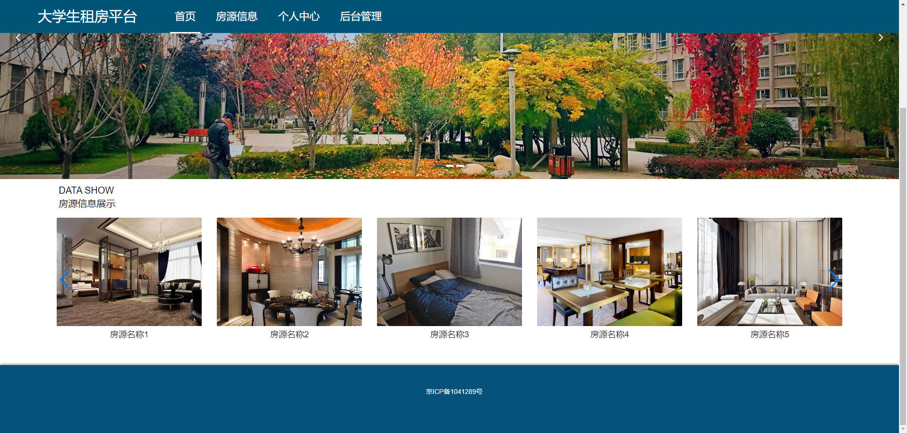


### 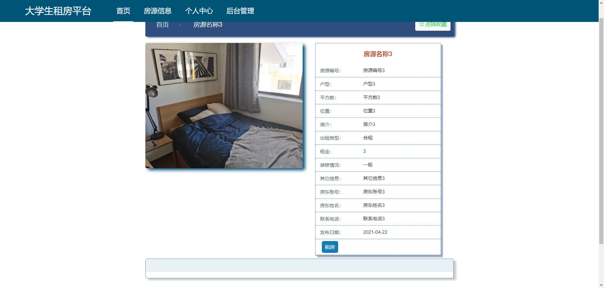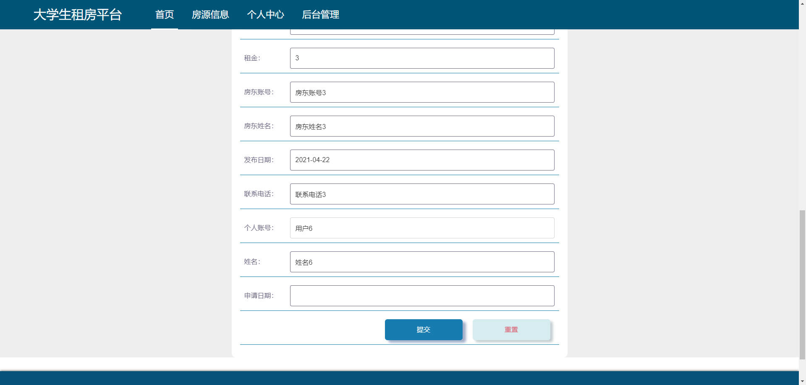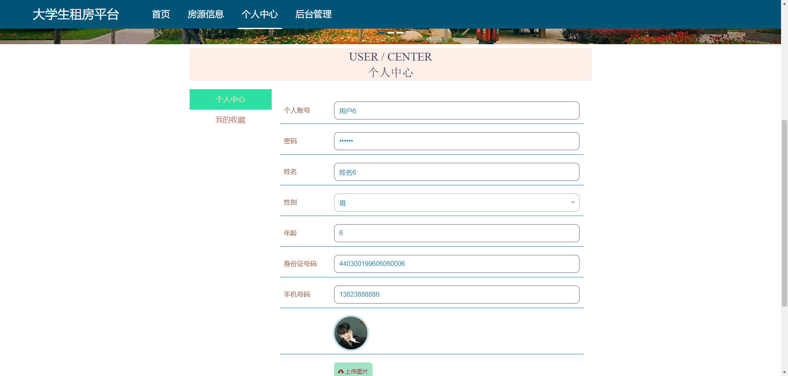后台

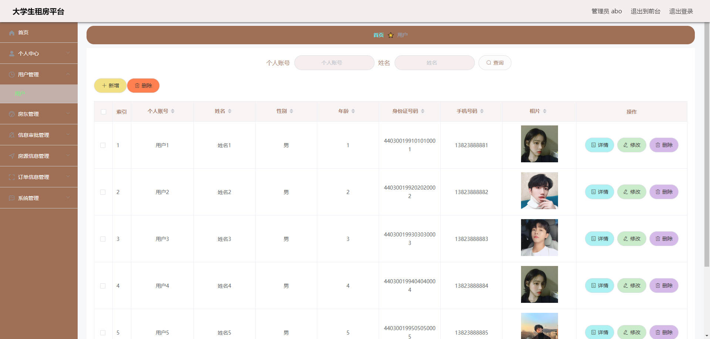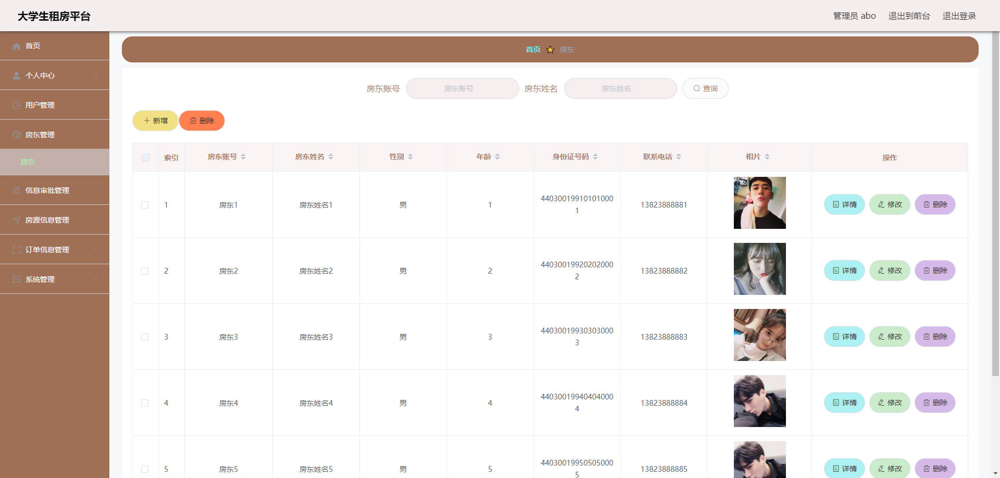

### 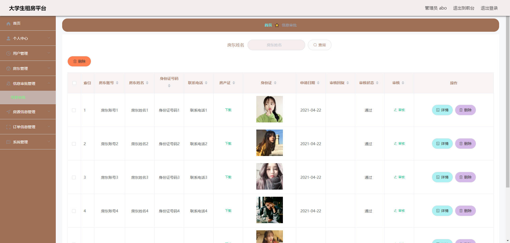

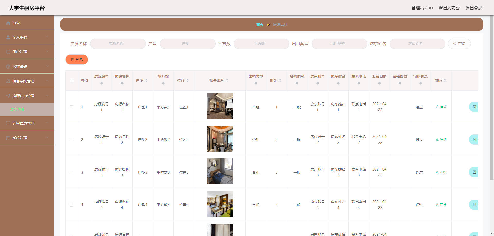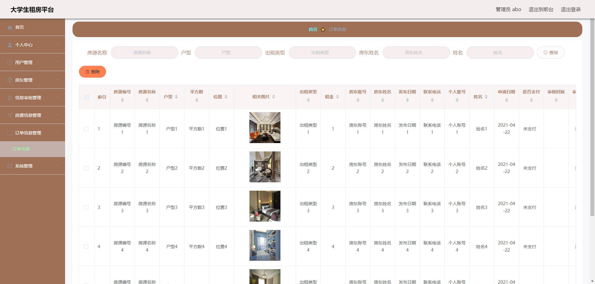

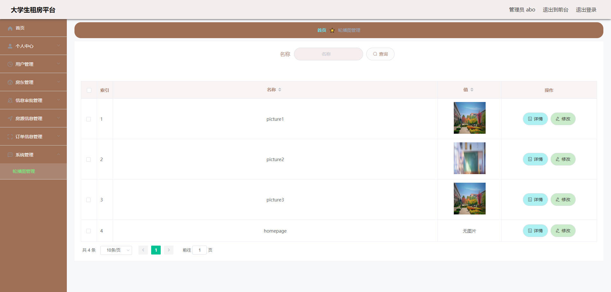

## 访问路径

### 前台

```properties
http://localhost:8080/springbootjeb55/front/pages/login/login.html

账号 用户6
密码 123456
```

### 后台

```properties
http://localhost:8080/springbootjeb55/admin/dist/index.html#/login

账号 abo
密码 abo
```


## 功能图

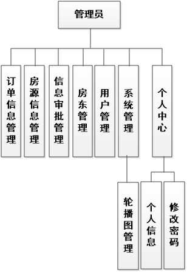


## 文档目录


## 打赏或交流


